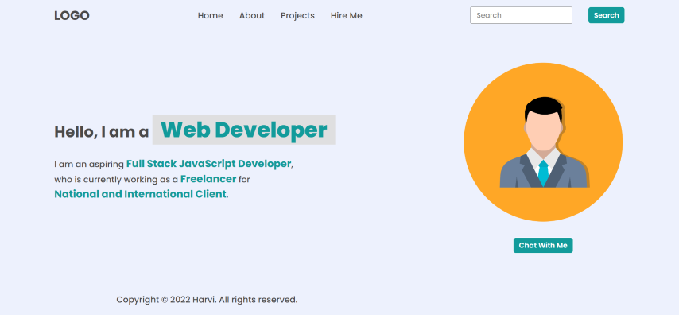
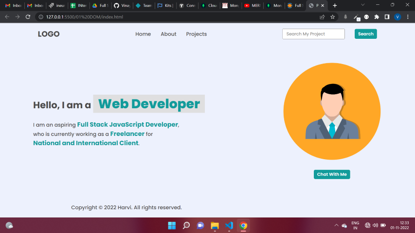
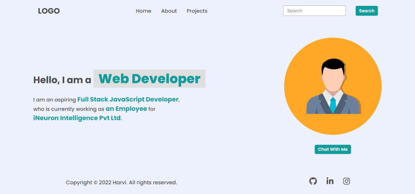
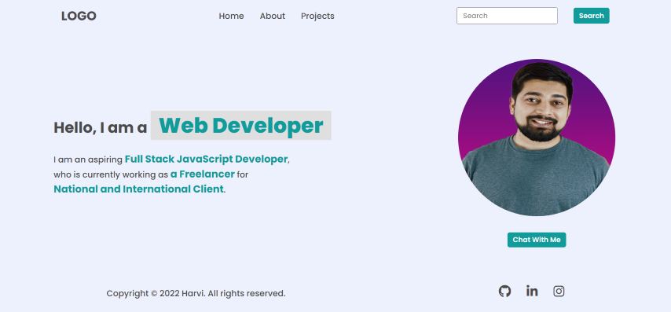
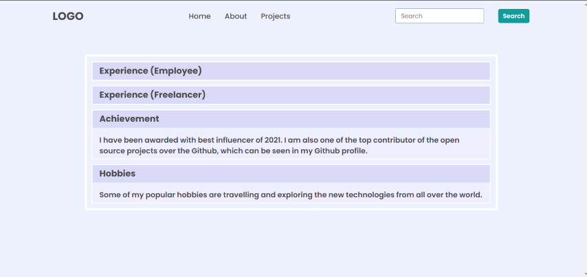
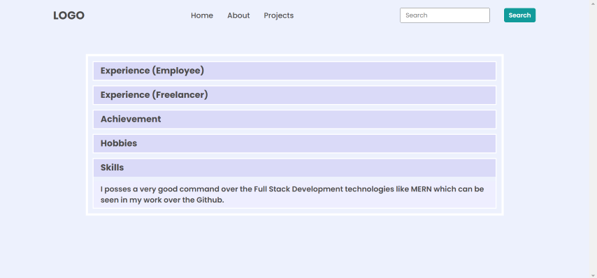
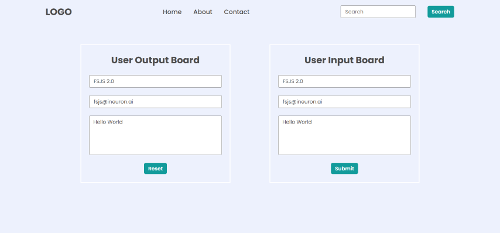

# DOM Assignments 1,2 and 3

## **Assignment  1 :** 
---
---

***Task 1*** :  Add a list item to the navigation section named " Hire Me ".



Ans. Code :👇

```
const nav_list = document.querySelector("nav ul");

const proj = nav_list.getElementsByTagName("li");
proj[proj.length-1].innerText = "Projects";

const hireMe = document.createElement("li");

hireMe.innerHTML = "<a>Hire Me</a>";

nav_list.appendChild(hireMe);
```

___

***Task 2*** :  Replace the placeholder value from "Search" to "Search My Project" and remove "Hire Me" .



Ans. Code : 👇

```
const placeHolder = document.querySelector(".search-field input");

placeHolder.setAttribute("placeholder","Search My Project");
```
---


***Task 3*** : Change the innerText of 2nd and 3rd span element inside .hero-left-section > p tag.



Ans. Code : 👇

```
const para = document.querySelector(".hero-left-section p");

const span = para.getElementsByTagName("span");
span[1].innerText = "an Employee";
span[2].innerText = "iNeuron Intelligence Pvt Ltd"
```
---

**Task 4** : Change the profile picture.



Ans. Code : 👇

```
const profilePic = document.querySelector(".hero-right-section img");
profilePic.setAttribute("src","./image.png");
```
---

**Task 5** : Add a "Support Me" button aside of "chat with me button.


Ans. Code : 👇

```
const pro_btn = document.querySelector(".hero-right-section-btns");
const support = document.createElement("button");
support.innerText = "Support Me";
support.style.padding = "5px";
support.style.width = "100px"

pro_btn.appendChild(support);
```
---

## **Assignment  2 :** 
---
---

***TASK 1 :*** Change the backgroundColor of headings in "About section".


Ans. Code : 👇
```
//It will select all heading elements👇
const h3_background = document.querySelectorAll(".accordian h3"); 


//It will convert that group of elements into array 👇
let bg_color = [...h3_background];


//It will change the background color of h3 elements.👇
bg_color.map((ele)=> ele.style.backgroundColor = "#DDDDDD");
```
---

***TASK 2 :*** Add a Skills section in the about page.


Ans. Code: 👇

```
//Selects main div .👇
const acc_wrapper = document.querySelector(".accordian-wrapper");

//Creates new element named skills and sets class "accordian".👇
const skills = document.createElement("div");
skills.setAttribute("class","accordian");


<!-- Creates new element h3 and after adding innerText appended it -->👇

const skill_h3 = document.createElement("h3");
skill_h3.innerText = "Skills";
skills.appendChild(skill_h3);


<!-- Creates new element p and after adding innerText appended it -->👇

const skills_p = document.createElement("p");

skills_p.innerText = "I posses a very good command over the Full Stack Development technologies like MERN which can be seen in my work over the Github.";

skills.append(skills_p);


<!-- appended div element to the main div. -->👇
acc_wrapper.appendChild(skills);
```
---

## **Assignment  3 :** 
---
---

***TASK :*** Change the placeholder of both forms.


Ans. Code : 👇
```
// left form modifications👇
document.querySelector(".mainLeftDetails :nth-child(1)").setAttribute("placeholder","FSJS 2.0");

document.querySelector(".mainLeftDetails :nth-child(2)").setAttribute("placeholder","fsjs@ineuron.ai");

document.querySelector(".mainLeftDetails :nth-child(3)").setAttribute("placeholder","Hello World");


// right form modification 👇
document.querySelector(".mainRight form :nth-child(1)").setAttribute("placeholder","FSJS 2.0");

document.querySelector(".mainRight form :nth-child(2)").setAttribute("placeholder","fsjs@ineuron.ai");

document.querySelector(".mainRight form :nth-child(3)").setAttribute("placeholder","Hello World");
```
---

# ❤️ Thank you for visiting 💚 !
---