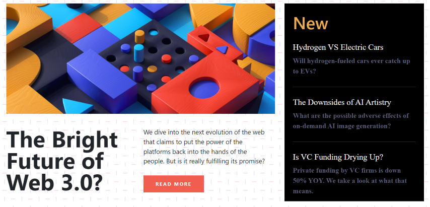
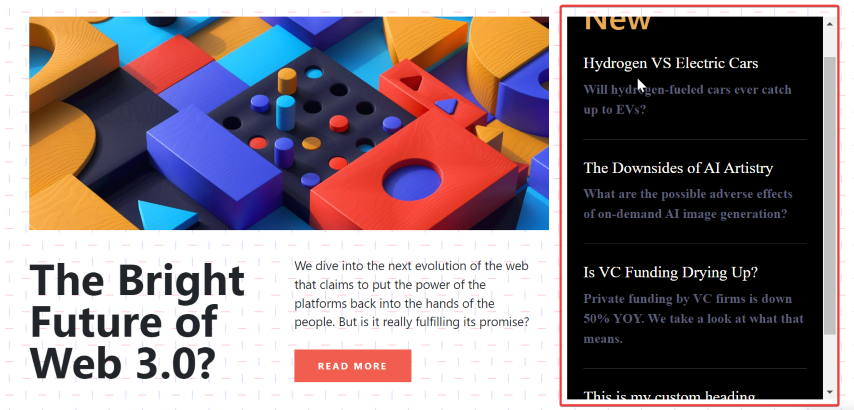
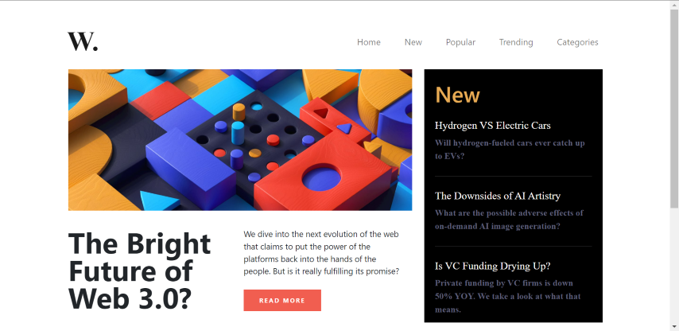
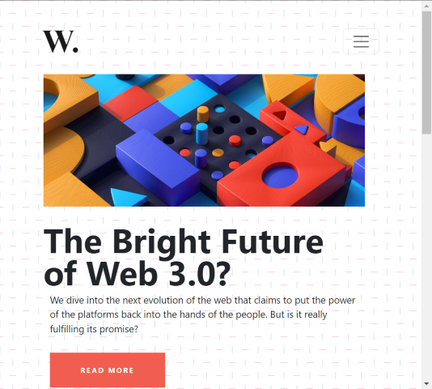
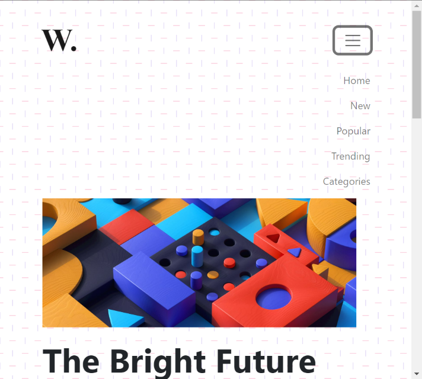

# ***DOM Assignments 8*** :-

***Task 1*** : Add a custom heading in aside section and with border red give scroll along y-axis.

### Before image


### After image


Ans. Code :

```
<!-- To select aside section -->
const aside = document.querySelector(".new");


<!--Border to the  aside section  -->
aside.style.border = "5px solid red";


<!-- Create custom heading section  -->
const hrLine = document.createElement("hr");
const heading = document.createElement("h2");
const para = document.createElement("p");


<!-- Gives the class name to achive same appearence as of othe elements -->
hrLine.className = "hr-line";
heading.className = "new-head";
para.className = "new-p";


<!-- Text content added to  custom section-->
heading.textContent = "This is my custom heading";
para.textContent = "This is my custom para ";


<!-- Appended custom elments to aside section -->
aside.appendChild(hrLine);
aside.appendChild(heading);
aside.appendChild(para);


<!-- Scroll over y-axis added -->
aside.style.overflowY = "scroll";
aside.style.overflowX = "hidden";


```

___
___
***Task 2*** : Make the background of page clear (White).

### Before image


### After image


Ans. Code :

```
document.body.style.backgroundImage = "none";
```
___
___
***Task 3*** : Make the background of page clear (White).

### Before image


### After image


Ans. Code :

```
<!-- Fetching the required elements from html file as given below -->
const navbar = document.querySelector(".navbar");
const logo = document.querySelector(".navbar-brand");
const button = document.querySelector(".navbar-toggler");
const navList = document.querySelector("#navbarTogglerDemo01");


<!-- Creating a new div element and appending button and nalist to it -->
const div  = document.createElement("div");
div.appendChild(button);
div.appendChild(navList);


<!-- appending div to main navbar -->
navbar.appendChild(div);


<!-- Adding event listner to the button -->
button.addEventListener("click",() => {
    
    <!-- this will bring logo on right position -->
    logo.style.position = "relative";
    logo.style.bottom = "87px";


    <!-- This will bring button in right size and position -->
    button.style.width = "max-content";
    button.style.marginLeft = "50px";
    button.style.marginBottom = "20px";
    

    <!-- This will make navlist visible  -->
    navList.removeAttribute("class","collapse");


    <!-- This will set all parameters as default -->
    button.addEventListener("click",() => {

        navList.setAttribute("class", "collapse");
        logo.style.position = "static";
    });
});    
```

# **🧡 Thank you for visiting 💚 !**