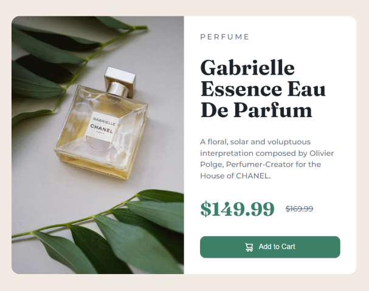
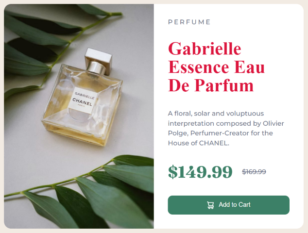
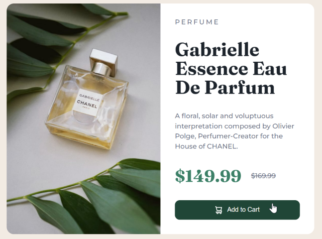
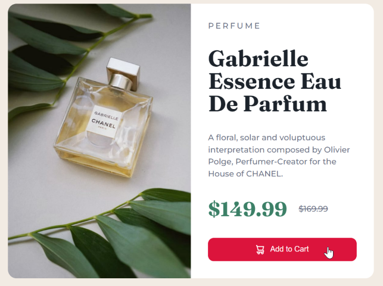

# ***DOM Assignments 9*** :-

***Task 1*** : Change the heading color.

### Before image


### After image


Ans. Code :

```
const heading  = document.querySelector(".caption .title");
heading.style.color = "#D61355";
```
___
___

***Task 2*** : Change the color color of cart button on click event.

### Before image 👇


### After image 👇


Ans. Code :

```
const cartButton = document.querySelector(".add-to-cart");

cartButton.addEventListener("click", () => {
    cartButton.style.backgroundColor = "#D61355";
});

```
___
___
#  💚 If you like hit that star 💫 for this repository 😉.
# 💥💛 Thanks for visiting ❤️!